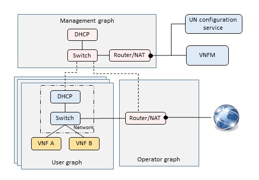

# Service deployment
This project relies on the Open Baton orchestrator in order to deploy a service, but the actual VNF instantiation is performed by the VIM. 

The Open Baton orchestrator supposes the VIM to:
* Provide an *IP network* primitive
* Provide to the VNFs instantiated a path toward the Open Baton generic VNFM
* The *network* assigns an IP address to all the vNICs that are attached to it 

Following it will be shown how this project satisfies the above requirements

## NFV service skeleton

When the Universal Node starts, it has to deploy two ancillary graphs: the [operator](Examples/Universal Node/operatorGraph.json) and the [management](Examples/Universal Node/managementGraph.json) graphs.
This graphs are connected to all the tenant graphs, which are gradually built by the Universal Node as soon as Open Baton requests VNFs and networks instantiation.

### Management graph
It provides a connection to the management modules, in a nutshell:
* It connects the VNFs that emulate a network to the Universal Node configuration service
* It connects the other VNFs to the Open Baton VNFM

In this project, all the VNFs are connected to the management graph through the *management interface*, which is an additional interface created by the UN VIM plugin before instantiating a VNF.

### Operator graph
It includes a NAT/Router providing floating IP addresses to the VNFs.
Only the VNFs associated to a floating IP are able to go on the Internet.

## Network emulation
Open Baton models a Service Access Point (SAP) of type *network* as a LAN that provides an Internet connection. The Open Baton Network Service Descriptor (NSD) refers to a network as Virtual Link (VL) of type E-LAN ([Here](Examples/NSD/NSD-private) an example).

Open Baton explodes an E-LAN VL with two requests toward the VIM plugin:
* Create Network
* Create Subnet

This project satisfies such requests instantiating a couple of VNFs (a switch and a DHCP). Such VNFs are under the responsibility of the Universal Node, which is in charge of their lyfe-cycle and management, and are hidden to the Open Baton orchestrator.

### Create Network
The VIM plugin create a switch for the emulation of a LAN.

### Create Subnet
The VIM plugin create a DHCP which is configured with the IP pool chosen by the Open Baton orchestrator.

