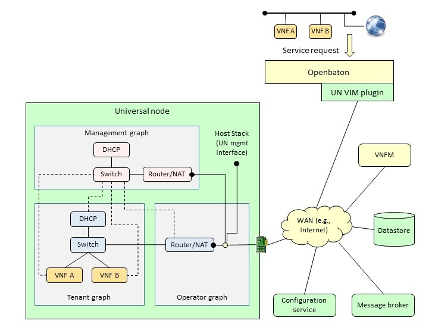

# Overall orchestration architecture


# Installation
This project needs the set up and installation of the following modules:
* [Open Baton orchestrator and VNFM (developer version)](http://openbaton.github.io/documentation/nfvo-installation-src/)
* [Universal Node orchestrator (openbaton_integration branch)](https://github.com/netgroup-polito/un-orchestrator/tree/openbaton_integration)
* [FROG4-Configuration service](https://github.com/netgroup-polito/frog4-config-service)
* [FROG4-Datastore](https://github.com/netgroup-polito/frog4-datastore)
* DoubleDecker and RabbitMQ message brokers

The configurable VNFs used by the configuration service can be found here:    [Agent configuration service](https://github.com/netgroup-polito/frog4-configurable-vnf)

Note that the installation of message brokers is part of the configuration service and Open Baton installation procedure.

## Generic VNFM
Before installing the Open Baton generic VNFM it is necessary to update the user-data script with the following [enriched version](Examples/Userdata/user-data.sh)
```sh
$ cd /opt/openbaton/generic-vnfm
$ cp [enriched user-data] src/main/resources/user-data.sh
$ ./gradlew build
```

## Other modules
Further information about the installation of the above modules may be found in the github page/website of the modules. 